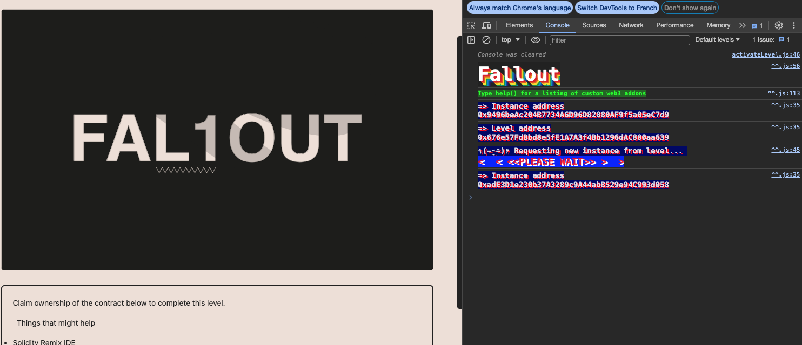
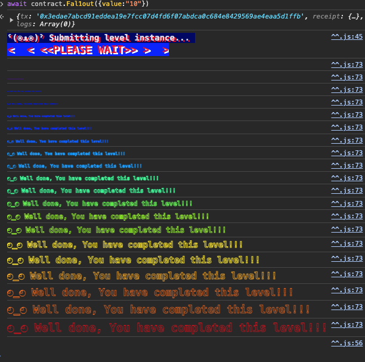

<!-- @format -->
# English README　[Jump to Japanese Version](#japanese)

# Ethernaut Solutions
- The Ethernaut is a Web3/Solidity-based coding wargame, played in the Ethereum Virtual Machine. 
- Each level is a smart contract that needs to be 'hacked'.

Here are the writeups of my solutions levels I cleared. 
** I will not recommend you to look at solutions I wrote. Solve it yourself for your learning 😛 **

# How to use Ethernaut
- To use ethernaut, you need to use the console from the developper tool of your browser in the first place.
- If your confortable with Foundry and Methods call using `cast` and `send`, you can also solve problem from Foundry framework.
- If you are not confortable yet with ABI, then it is a great way to learn about it and how to call any contract by external calls.
- In higher difficulty levels, you will need to wrote smart contracts and interfaces to hack some smart contract externally for clearing levels.

## Ethernaut 2. Fallout

The goal is to become the Owner of the smart contract.
- The best hint is in the presentation image of the problem. 

<br/>
<p align="center">

</p>
<br/>

- Carefull there is a typo error in the "constructor" of the smart contract. `fal1out` instead of `fallout`

- If you look closer, the `fal1out` is just a `public payable` function and not a constructor ! Constructor are initialized at deployment. 
So this function hasn't been initialized yet and we can just send a transaction and steal the ownership.  Just need to call it. 

```bash
await contract.Fal1out({value:"10"})
```

Level is completed.

<br/>
<p align="center">

</p>
<br/>

<a name="japanese"></a>
# 日本語版のREADME

# Ethernautの解決策
- Ethernautは、Web3/Solidityベースのコーディングウォーゲームで、Ethereum Virtual Machine (EVM) でプレイされます。
- 各レベルはハッキングする必要があるスマートコントラクトです。

これはクリアしたレベルの解決策です。
**解決策を見ることをお勧めしません。学習のために自分で解決してください 😛 **

# Ethernautの使用方法
- Ethernautを使用するには、まずブラウザの開発者ツールからコンソールを使用する必要があります。
- Foundryとcastおよびsendを使用した方法の呼び出しに慣れている場合、Foundryフレームワークから問題を解決することもできます。
- まだABIに慣れていない場合、それを使用して任意のコントラクトを外部呼び出しで呼び出す方法について学び、理解するのに最適な方法です。
- より高難度のレベルでは、スマートコントラクトとインターフェースを作成して、いくつかのスマートコントラクトを外部からハッキングするために解レベルをクリアする必要があります。

## Ethernaut 2. Fallout

- 目標は、スマートコントラクトの所有者になることです。
最も役立つヒントは、問題のプレゼンテーション画像にあります。

<br/>
<p align="center">

</p>
<br/>

- 注意：スマートコントラクトの「constructor」にタイプミスがあります。 `fallout` ではなく `fal1out` です。

- よく見ると、 `fal1out` は単なる「public payable」関数であり、コンストラクターではありません！コンストラクトはデプロイ時に初期化されます。したがって、
- この関数はまだ初期化されておらず、トランザクションを送信して所有権を奪うことができます。ただそれを呼び出すだけです。

```bash
await contract.Fal1out({value:"10"})
```


レベルが完了。

<br/>
<p align="center">

</p>
<br/>
